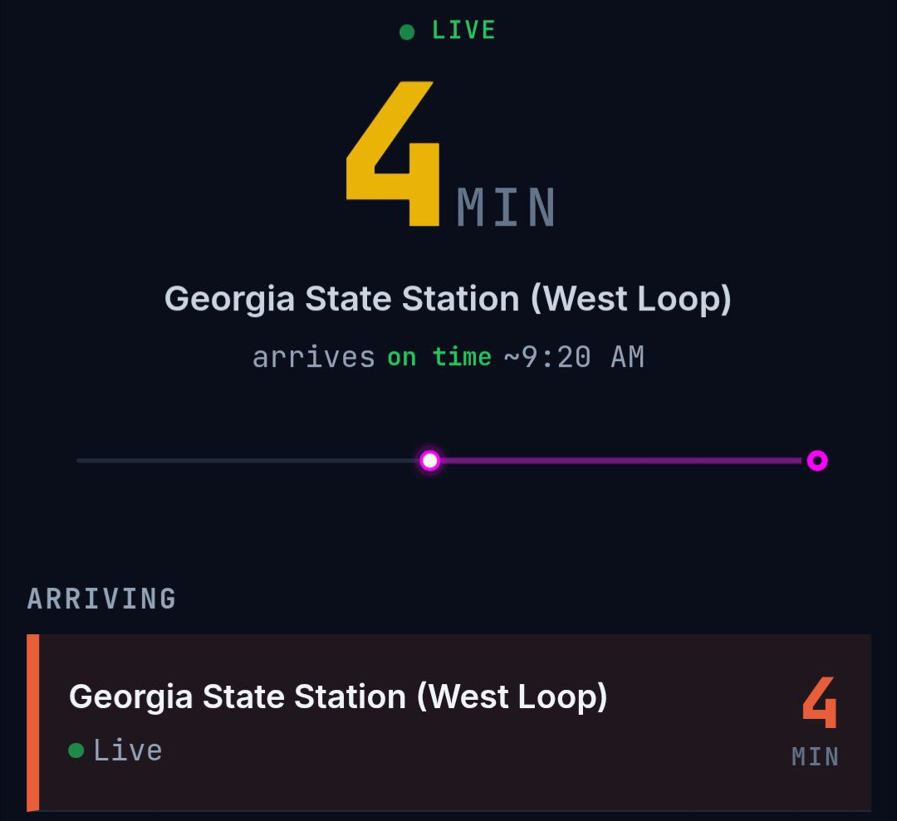

# Pullcord Milestones

## 2026-02-17: First Successful Cord Notification → Caught the Bus

**The first time "Pull the Cord" worked end-to-end in the field.**

Jake set a cord on Route 21, westbound toward Georgia State Station, at Memorial/Gibson Dr (stop 104064). The notification fired at ~14 min out. He walked to the stop. Waited about 1 minute. Bus arrived.

### What was running:
- Computed ETA from bus GPS position + scheduled inter-stop deltas
- Terminal fallback: bus at first stop → use MARTA's ETA (accounts for layover)
- Push with `urgency: high` and `TTL: 300` — phone buzzed immediately
- `requireInteraction: true` — notification stayed until tapped

### What we found along the way:
- Ghost predictions: MARTA pre-assigns buses to next trip before current one finishes. Fixed with tier classification from vehicle position cross-reference. (See `GHOST_PREDICTIONS.md`)
- Terminal ETA edge case: bus sitting at GA State terminal, computed ETA thought it was moving. Fixed with first-stop fallback.
- Notification said "Route 27335" instead of "Route 21" — internal ID leak. Fixed.
- Chrome notification tap did nothing — `client.navigate()` silently fails on Chrome Android. Fixed with postMessage pattern.
- Progress strip "stops away" text was clipped by SVG height. Fixed.
- Cancelled trips (Presidents Day): MARTA feed had 167 cancellations, none in their alerts endpoint. Trip updates handle this correctly by absence — we only show buses that actually exist.

### Conditions:
- Presidents Day (reduced service), ~3 buses on Route 21
- Light traffic, morning
- Not yet validated under rush hour / heavy traffic
